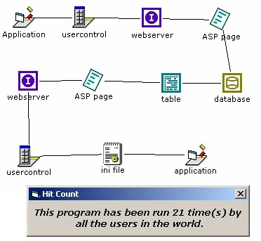



## RGCC \- Challenge1 Candidate

### Description

Just wanted to stab at this contest...I know a lot more can be added to this to make it more...complex yet fun...but I am at work and this is what I could through together during lunch. This program will just tell you the number of times the program was ran by using a custom control to access a ASP page on an external website which connects to a database to read the hit count then the ASP formats the results in INI format then the custom control saves that dowloaded ASP page to an INI file on the users hard drive then uses simple API calls tor read the value and display it. Just wanted to start of the contest with a little something that uses the web as well.

BTW: The custom control code is included since I know you are not supposed to upload OCX's. The control was made by me and you can find a compiled version at http://lafever.iscool.net if you like it.
 
### More Info
 

             |
---                |---
**Submitted On**   |2002-04-23 14:20:26
**By**             |[Clint LaFever](https://github.com/Planet-Source-Code/PSCIndex/blob/master/ByAuthor/clint-lafever.md)
**Level**          |Intermediate
**User Rating**    |5.0 (35 globes from 7 users)
**Compatibility**  |VB 6\.0
**Category**       |[Miscellaneous](https://github.com/Planet-Source-Code/PSCIndex/blob/master/ByCategory/miscellaneous__1-1.md)
**World**          |[Visual Basic](https://github.com/Planet-Source-Code/PSCIndex/blob/master/ByWorld/visual-basic.md)
**Archive File**   |[RGCC\_\-\_Cha749484232002\.zip](https://github.com/Planet-Source-Code/clint-lafever-rgcc-challenge1-candidate__1-24875/archive/master.zip)

